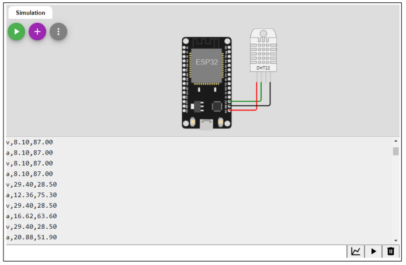
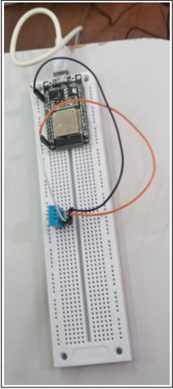
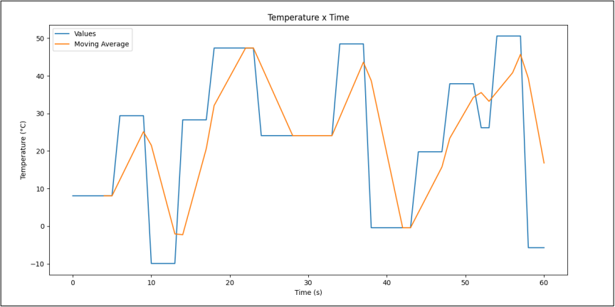
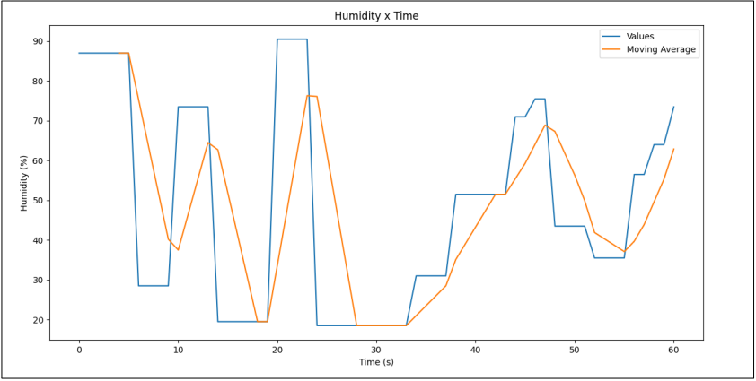

## Simple Semaphore using Arduino-Uno
An ESP32 microcontroller and a DHT22 temperature and humidity sensor were used. In one core, the values of temperature and humidity were taken and in the second core, the moving average was calculated.

### Source Code
The source code can be found in the **src** directory.
- **esp32.ino** file
- **data.csv** file
    - Data gathered from the Woki Platform (was get manually)
- **graphs.py** file
    - Used to make analysis in the data gathered from the Woki Platform

### Assembly using the Woki Platform

        

### Practical Assembly

        

### Temperature Analysis

        

### Humidity Analysis

        

